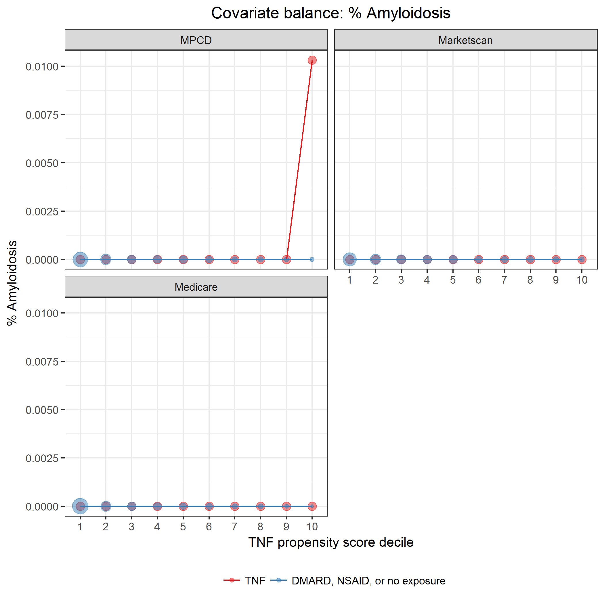
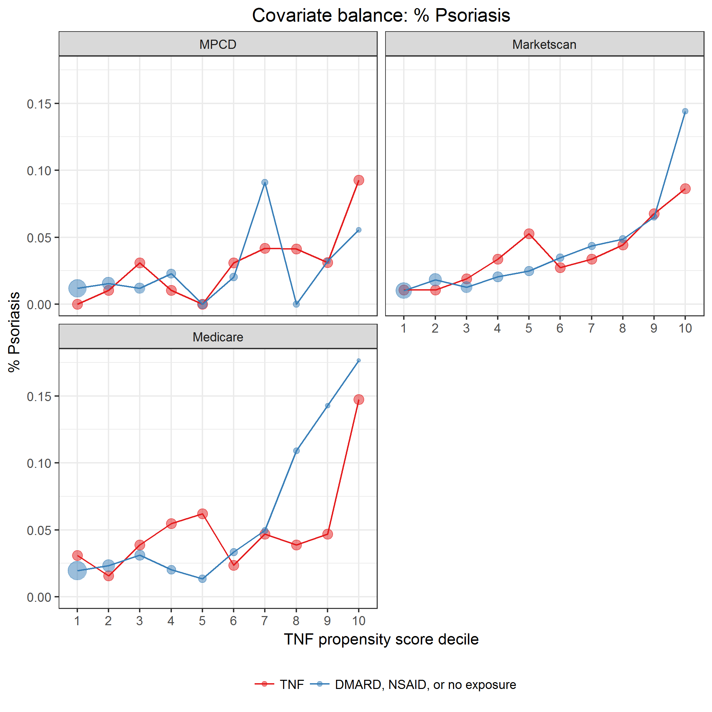

# Propensity score

November 27, 2017

## Description of model

See [`modelPropensityScore.sas`](../scripts/modelPropensityScore.sas) script for details on model.

The propensity of exposure to the three treatments: TNF, DMARD, and NSAID or no exposure, was modeled using a multinomial logistic regression model (SAS `proc logistic`).
The link function used was a generalized logit.
TNF exposure was used as the reference exposure.

Included independent variables:

Variable name | Description
--------------|------------
database | MPCD, Marketscan, or Medicare (3-levels)
age | Continuous
sex | Male, Female
indAmyloidosis | Amyloidosis (any prior to exposure)
indAortInsuffRegurg | Aortic Insufficiency/Aortic Regurgitation (any prior to exposure)
indApicalPulmFib | Apical Pulmonary fibrosis (any prior to exposure)
indCaudaEquina | Cauda Equina syndrome (any prior to exposure)
indVertFrac | Clinical vertebral fracture (any prior to exposure)
indConductBlock | Conduction Block (any prior to exposure)
indCrohnsDis | Crohn’s Disease (any prior to exposure)
indHematCa | Hematologic Cancer (any prior to exposure)
indHospInf | Hospitalized infection (any prior to exposure)
indIgANeph | IgA nephropathy (any prior to exposure)
indInterstLungDis | Interstitial lung disease (any prior to exposure)
indMI | Myocardial infarction (any prior to exposure)
indNephSyn | Nephrotic syndrome (any prior to exposure)
indNMSC | Non Melanoma Skin Cancer (any prior to exposure)
indNonVertOsFrac | Non-vertebral osteoporotic fracture (any prior to exposure)
indOppInf | Opportunistic infection (any prior to exposure)
indPsoriasis | Psoriasis (any prior to exposure)
indPSA | Psoriatic arthritis (any prior to exposure)
indRestrictLungDis | Restrictive lung disease (any prior to exposure)
indSolidCa | Solid Cancer (any prior to exposure)
indSpinalCordComp | Spinal Cord compression (any prior to exposure)
indUlcerColitis | Ulcerative Colitis (any prior to exposure)
indUveitis | Uveitis (any prior to exposure)
indDiabetes | Diabetes
indHT | Hypertention
indMetabSyn | Metabolic syndrome
indNAFattyLiverDis | Non-alcoholic fatty liver disease

Model output is probability of exposure to TNF, DMARD, and NSAID or no exposure.
For our purposes, we focus only on the propensity for TNF exposure.

The common support region lower bound is the maximum of the lowest TNF propensity score among the 3 exposure groups.
The common support region upper bound is the minimum of the greatest TNF propensity score among the 3 exposure groups.

To check covariate balance, subjects are partitioned into deciles defined by the TNF propensity score, regardless of true exposure.
Model covariates are plotted on the y-axis in relation to TNF propensity decile on the x-axis.
Comparisons are made between exposure groups to check for balance.

Inverse probability treatment weight (IPTW) for TNF exposure was calculated as

$$
IPTW_\text{TNF} = \frac{I_\text{TNF}}{\hat{p}_\text{TNF}} + \frac{1 - I_\text{TNF}}{1 - \hat{p}_\text{TNF}}
$$

where $I_\text{TNF}$ is a 0/1 indicator for TNF exposure.

Stabilized IPTW are calculated as described in
Austin, P. C., and Stuart, E. A. (2015) Moving towards best practice when
using inverse probability of treatment weighting (IPTW) using the propensity
score to estimate causal treatment effects in observational studies. Statist.
Med., 34: 3661–3679. 
doi: [10.1002/sim.6607](http://onlinelibrary.wiley.com/doi/10.1002/sim.6607/abstract).

## Import data sets

Read deidentified propensity score data.
Data was created by [`modelPropensityScore.sas`](../scripts/modelPropensityScore.sas).

* Image files saved as [PNG](../figures/densityPS.png), [SVG](../figures/densityPS.svg)

\newline

|indCommonSupport |model            |exposure             |     n| minPS| maxPS| minIPTW| maxIPTW|
|:----------------|:----------------|:--------------------|-----:|-----:|-----:|-------:|-------:|
|FALSE            |3-level exposure |TNF                  |    12| 0.764| 0.810|   1.234|   1.308|
|FALSE            |3-level exposure |DMARD                |    15| 0.000| 0.799|   1.000|   4.976|
|FALSE            |3-level exposure |NSAID or no exposure |    60| 0.000| 0.031|   1.000|   1.032|
|TRUE             |3-level exposure |TNF                  | 12974| 0.031| 0.759|   1.318|  32.043|
|TRUE             |3-level exposure |DMARD                |  7704| 0.031| 0.758|   1.032|   4.126|
|TRUE             |3-level exposure |NSAID or no exposure | 39244| 0.032| 0.762|   1.033|   4.195|
|NA               |3-level exposure |TNF                  |     1|    NA|    NA|      NA|      NA|

\newline

|model            | commonSupportLowerBound| commonSupportUpperBound|
|:----------------|-----------------------:|-----------------------:|
|3-level exposure |               0.0312083|               0.7616191|

## Covariate balance

Include only episodes with propensity scores in the common support region.

**Propensity of TNF.**
Create propensity score deciles.

|model            |exposure             | psDecile|    n|  min|  max|
|:----------------|:--------------------|--------:|----:|----:|----:|
|3-level exposure |TNF                  |        1|  266| 0.03| 0.09|
|3-level exposure |TNF                  |        2|  475| 0.09| 0.11|
|3-level exposure |TNF                  |        3|  696| 0.11| 0.12|
|3-level exposure |TNF                  |        4|  863| 0.12| 0.15|
|3-level exposure |TNF                  |        5| 1139| 0.15| 0.19|
|3-level exposure |TNF                  |        6| 1348| 0.19| 0.23|
|3-level exposure |TNF                  |        7| 1667| 0.23| 0.27|
|3-level exposure |TNF                  |        8| 1912| 0.27| 0.32|
|3-level exposure |TNF                  |        9| 2022| 0.32| 0.39|
|3-level exposure |TNF                  |       10| 2586| 0.39| 0.76|
|3-level exposure |DMARD                |        1|  535| 0.03| 0.09|
|3-level exposure |DMARD                |        2|  807| 0.09| 0.11|
|3-level exposure |DMARD                |        3|  776| 0.11| 0.12|
|3-level exposure |DMARD                |        4|  820| 0.12| 0.15|
|3-level exposure |DMARD                |        5|  820| 0.15| 0.19|
|3-level exposure |DMARD                |        6|  877| 0.19| 0.23|
|3-level exposure |DMARD                |        7|  778| 0.23| 0.27|
|3-level exposure |DMARD                |        8|  812| 0.27| 0.32|
|3-level exposure |DMARD                |        9|  694| 0.32| 0.39|
|3-level exposure |DMARD                |       10|  785| 0.39| 0.76|
|3-level exposure |NSAID or no exposure |        1| 5192| 0.03| 0.09|
|3-level exposure |NSAID or no exposure |        2| 4751| 0.09| 0.11|
|3-level exposure |NSAID or no exposure |        3| 4481| 0.11| 0.12|
|3-level exposure |NSAID or no exposure |        4| 4310| 0.12| 0.15|
|3-level exposure |NSAID or no exposure |        5| 4032| 0.15| 0.19|
|3-level exposure |NSAID or no exposure |        6| 3744| 0.19| 0.23|
|3-level exposure |NSAID or no exposure |        7| 3649| 0.23| 0.27|
|3-level exposure |NSAID or no exposure |        8| 3293| 0.27| 0.32|
|3-level exposure |NSAID or no exposure |        9| 3172| 0.32| 0.39|
|3-level exposure |NSAID or no exposure |       10| 2620| 0.39| 0.76|

\newline

### Demographic characteristics

### Other covariates

### Comorbidities

### Extra-articular manifestations (EAMs)

