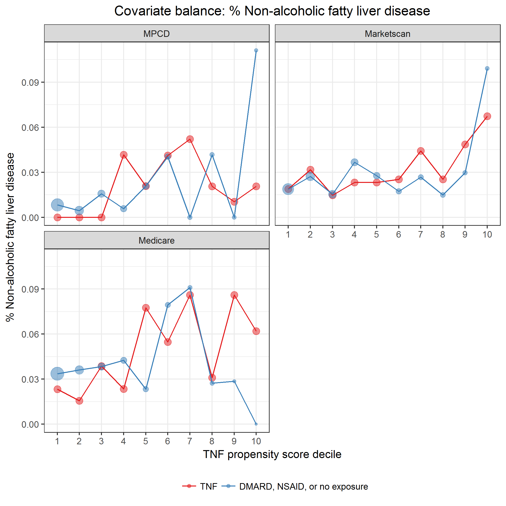

# Propensity score

Read deidentified propensity score data.
Data was created by [`modelPropensityScore.sas`](../scripts/modelPropensityScore.sas).

* Image files saved as [PNG](../figures/densityPS.png), [SVG](../figures/densityPS.svg)

\newline

|indCommonSupport |model            |exposure             |     n| minPS| maxPS| minIPTW| maxIPTW|
|:----------------|:----------------|:--------------------|-----:|-----:|-----:|-------:|-------:|
|FALSE            |3-level exposure |TNF                  |     5| 0.055| 0.080|   1.058|   1.087|
|FALSE            |3-level exposure |DMARD                |     3| 0.889| 0.914|   9.011|  11.634|
|FALSE            |3-level exposure |NSAID or no exposure |   148| 0.068| 0.930|   1.075|  14.761|
|TRUE             |3-level exposure |TNF                  | 12981| 0.089| 0.886|   1.097|   8.760|
|TRUE             |3-level exposure |DMARD                |  7716| 0.082| 0.885|   1.089|   8.687|
|TRUE             |3-level exposure |NSAID or no exposure | 39156| 0.095| 0.886|   1.129|  10.572|
|NA               |3-level exposure |TNF                  |     1|    NA|    NA|      NA|      NA|

\newline

|model            | commonSupportLowerBound| commonSupportUpperBound|
|:----------------|-----------------------:|-----------------------:|
|3-level exposure |                0.082114|               0.8858425|

## Covariate balance

Include only episodes with propensity scores in the common support region.

**Propensity of NSAID or no exposure.**
Create propensity score deciles.

|model            |exposure             | psDecile|    n|  min|  max|
|:----------------|:--------------------|--------:|----:|----:|----:|
|3-level exposure |TNF                  |        1| 2585| 0.09| 0.47|
|3-level exposure |TNF                  |        2| 1923| 0.47| 0.55|
|3-level exposure |TNF                  |        3| 1836| 0.55| 0.60|
|3-level exposure |TNF                  |        4| 1636| 0.60| 0.64|
|3-level exposure |TNF                  |        5| 1424| 0.64| 0.68|
|3-level exposure |TNF                  |        6| 1224| 0.68| 0.71|
|3-level exposure |TNF                  |        7|  852| 0.71| 0.74|
|3-level exposure |TNF                  |        8|  690| 0.74| 0.77|
|3-level exposure |TNF                  |        9|  541| 0.77| 0.80|
|3-level exposure |TNF                  |       10|  270| 0.80| 0.89|
|3-level exposure |DMARD                |        1|  950| 0.08| 0.47|
|3-level exposure |DMARD                |        2|  761| 0.47| 0.55|
|3-level exposure |DMARD                |        3|  785| 0.55| 0.60|
|3-level exposure |DMARD                |        4|  882| 0.60| 0.64|
|3-level exposure |DMARD                |        5|  800| 0.64| 0.68|
|3-level exposure |DMARD                |        6|  797| 0.68| 0.71|
|3-level exposure |DMARD                |        7|  856| 0.71| 0.74|
|3-level exposure |DMARD                |        8|  813| 0.74| 0.77|
|3-level exposure |DMARD                |        9|  623| 0.77| 0.80|
|3-level exposure |DMARD                |       10|  449| 0.80| 0.88|
|3-level exposure |NSAID or no exposure |        1| 2512| 0.09| 0.47|
|3-level exposure |NSAID or no exposure |        2| 3240| 0.47| 0.55|
|3-level exposure |NSAID or no exposure |        3| 3374| 0.55| 0.60|
|3-level exposure |NSAID or no exposure |        4| 3457| 0.60| 0.64|
|3-level exposure |NSAID or no exposure |        5| 3782| 0.64| 0.68|
|3-level exposure |NSAID or no exposure |        6| 3989| 0.68| 0.71|
|3-level exposure |NSAID or no exposure |        7| 4244| 0.71| 0.74|
|3-level exposure |NSAID or no exposure |        8| 4533| 0.74| 0.77|
|3-level exposure |NSAID or no exposure |        9| 4825| 0.77| 0.80|
|3-level exposure |NSAID or no exposure |       10| 5200| 0.80| 0.89|

\newline

### Demographic characteristics

### Other covariates

### Comorbidities

### Extra-articular manifestations (EAMs)

