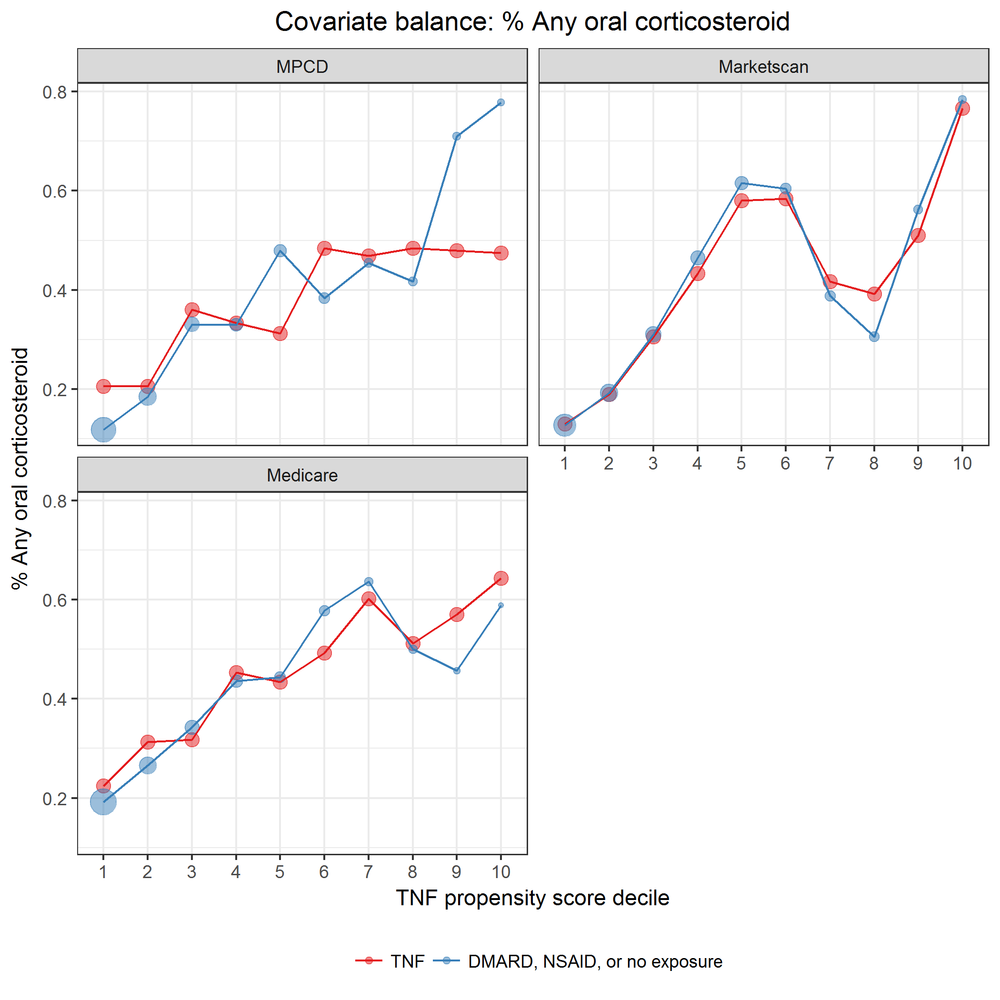
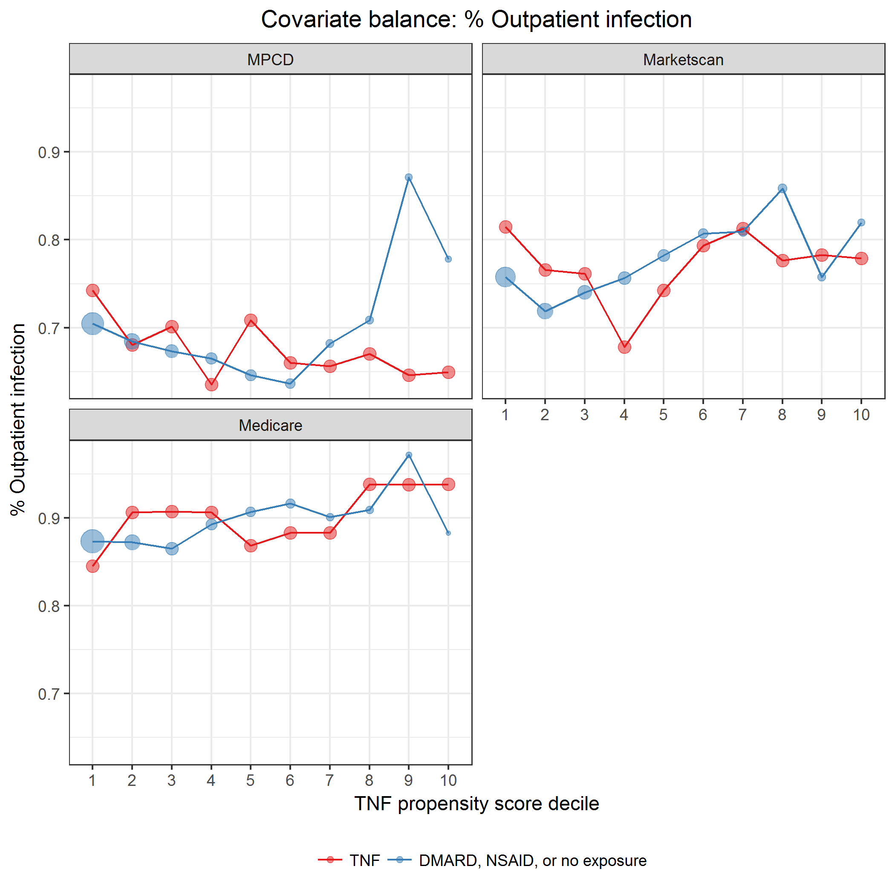
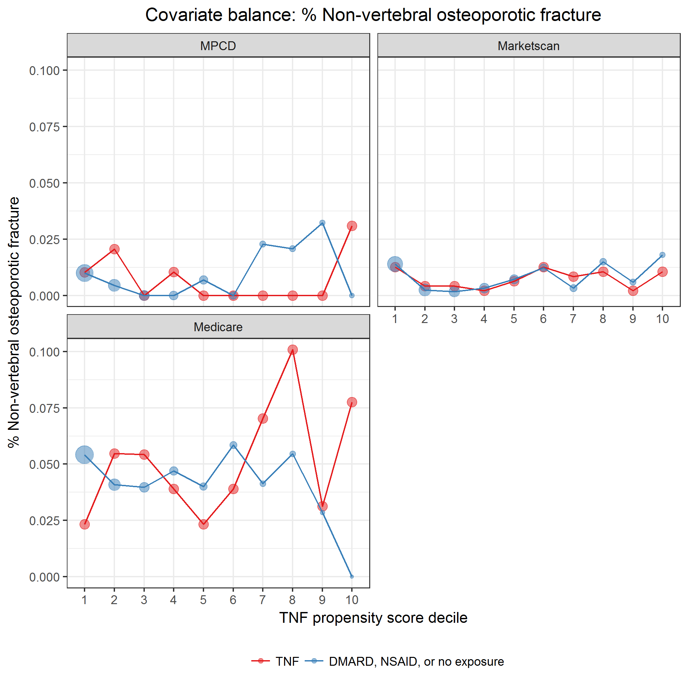

# Propensity score

November 26, 2018

## Description of model

See [`modelPropensityScore.sas`](../scripts/modelPropensityScore.sas) script for details on model.

The propensity of exposure to the two treatments: TNF versus DMARD, NSAID, or no exposure, was modeled using a logistic regression model (SAS `proc logistic`).

Included independent variables:

Variable name | Description
--------------|------------
age | Categorized: <19, 19-29, 30-39, 40-49, 50-59, 60-69, 70+
sex | Male, Female
indAmyloidosis | Amyloidosis (any prior to exposure)
indAortInsuffRegurg | Aortic Insufficiency/Aortic Regurgitation (any prior to exposure)
indApicalPulmFib | Apical Pulmonary fibrosis (any prior to exposure)
indCaudaEquina | Cauda Equina syndrome (any prior to exposure)
indVertFrac | Clinical vertebral fracture (any prior to exposure)
indConductBlock | Conduction Block (any prior to exposure)
indCrohnsDis | Crohn’s Disease (any prior to exposure)
indHematCa | Hematologic Cancer (any prior to exposure)
indHospInf | Hospitalized infection (any prior to exposure)
indIgANeph | IgA nephropathy (any prior to exposure)
indInterstLungDis | Interstitial lung disease (any prior to exposure)
indMI | Myocardial infarction (any prior to exposure)
indNephSyn | Nephrotic syndrome (any prior to exposure)
indNMSC | Non Melanoma Skin Cancer (any prior to exposure)
indNonVertOsFrac | Non-vertebral osteoporotic fracture (any prior to exposure)
indOppInf | Opportunistic infection (any prior to exposure)
indPsoriasis | Psoriasis (any prior to exposure)
indPSA | Psoriatic arthritis (any prior to exposure)
indRestrictLungDis | Restrictive lung disease (any prior to exposure)
indSolidCa | Solid Cancer (any prior to exposure)
indSpinalCordComp | Spinal Cord compression (any prior to exposure)
indUlcerColitis | Ulcerative Colitis (any prior to exposure)
indUveitis | Uveitis (any prior to exposure)
indDiabetes | Diabetes
indHT | Hypertention
indMetabSyn | Metabolic syndrome
indNAFattyLiverDis | Non-alcoholic fatty liver disease
indCOPDEmphysema | COPD or emphysema
meanPredEqDoseCat | Categorized: None, Low (<2.5 mg/d), Medium-Low (2.5-5 mg/d), Medium-High (5-10 mg/d), High (10+ mg/d)
quartileCharlson | Charlson comorbidity index: quartiles within data source
indInflamMarker | 1+ Sedimentation rate, erythrocyte or C-reactive protein CPT code
indRxNSAID | Prescription drug indicator: NSAID
indRxHtn | Prescription drug indicator: Antihypertensive
indRxNarcotics | Prescription drug indicator: Narcotic
indRxFungus | Prescription drug indicator: Antifungal
indRxOP_bisphosp | Prescription drug indicator: Bisphosphonate
indRxThiazide | Prescription drug indicator: Thiazide
indRxAnticoagulant | Prescription drug indicator: Anticoagulant
indRxAntibiotics | Prescription drug indicator: Antibiotics
countIPAdmit12mPrior | Number of inpatient admission 12 months prior to exposure
indERVisit12mPrior | ER visit 12 months prior to exposure
countAVRheum12mPrior | Number of rheumatologist visits 12 months prior
indRxBiologics | Prescription drug indicator: Biologics, 7+ months prior
indOutpatientInfection | Outpatient infectiion

Model output is probability of exposure to TNF.

Model estimation was performed separately for the 3 data sources: MPCD, Marketscan, and Medicare.
Independent variables were excluded from model estimation if they led to unstable estimates when included in data source-specific models.
This can occur if the covariate is so rare that zero records with this covariate appear in the model estimation cohort.

The common support region lower bound is the maximum of the lowest TNF propensity score among the 2 exposure groups.
The common support region upper bound is the minimum of the greatest TNF propensity score among the 2 exposure groups.

To check covariate balance, subjects are partitioned into deciles defined by the TNF propensity score, regardless of true exposure.
Model covariates are plotted on the y-axis in relation to TNF propensity decile on the x-axis.
Comparisons are made between exposure groups to check for balance.
Balance is indicated if the plots overlap.
Systematic deviations of the lines indicate residual imbalance not accounted for by the propensity scores.
Variables that exhibit such deviations should be considered for inclusion as a covariate in the outcomes models.

Inverse probability treatment weight (IPTW) for TNF exposure was calculated as

$$
IPTW_\text{TNF} = \frac{I_\text{TNF}}{\hat{p}_\text{TNF}} + \frac{1 - I_\text{TNF}}{1 - \hat{p}_\text{TNF}}
$$

where $I_\text{TNF}$ is a 0/1 indicator for TNF exposure.

IPTW will be **low** if

* True exposure was TNF **and** propensity for TNF was high, or
* True exposure was not TNF **and** propensity for TNF was low

I.e., individuals are weighted higher if the true exposure is contrary to the propensity.

Stabilized IPTW are calculated as described in
Austin, P. C., and Stuart, E. A. (2015) Moving towards best practice when
using inverse probability of treatment weighting (IPTW) using the propensity
score to estimate causal treatment effects in observational studies. Statist.
Med., 34: 3661–3679. 
doi: [10.1002/sim.6607](http://onlinelibrary.wiley.com/doi/10.1002/sim.6607/abstract).

## Import data sets

Read deidentified propensity score data.
Data was created by [`modelPropensityScore.sas`](../scripts/modelPropensityScore.sas).

* Image files saved as [PNG](../figures/densityPS.png), [SVG](../figures/densityPS.svg)

\newline

Summarize propensity scores and IPTWs by data source and exposure.

|indCommonSupport |database   |exposure                     |     n| minPS| maxPS| minIPTW| maxIPTW|
|:----------------|:----------|:----------------------------|-----:|-----:|-----:|-------:|-------:|
|FALSE            |MPCD       |TNF                          |     4| 0.975| 0.984|   1.017|   1.026|
|FALSE            |MPCD       |DMARD, NSAID, or no exposure |    98| 0.000| 0.002|   1.000|   1.002|
|FALSE            |Marketscan |TNF                          |     7| 0.904| 0.943|   1.061|   1.106|
|FALSE            |Marketscan |DMARD, NSAID, or no exposure |    77| 0.012| 0.023|   1.012|   1.023|
|FALSE            |Medicare   |TNF                          |     1| 0.821| 0.821|   1.217|   1.217|
|FALSE            |Medicare   |DMARD, NSAID, or no exposure |    52| 0.000| 0.002|   1.000|   1.002|
|TRUE             |MPCD       |TNF                          |   855| 0.002| 0.970|   1.030| 547.824|
|TRUE             |MPCD       |DMARD, NSAID, or no exposure |  2663| 0.002| 0.974|   1.002|  37.813|
|TRUE             |Marketscan |TNF                          |  4033| 0.023| 0.899|   1.112|  43.338|
|TRUE             |Marketscan |DMARD, NSAID, or no exposure |  9945| 0.023| 0.903|   1.024|  10.314|
|TRUE             |Medicare   |TNF                          |   678| 0.002| 0.764|   1.309| 502.018|
|TRUE             |Medicare   |DMARD, NSAID, or no exposure | 14589| 0.002| 0.812|   1.002|   5.323|

\newline

Summarize common support region bounds.

|database   | commonSupportLowerBound| commonSupportUpperBound|
|:----------|-----------------------:|-----------------------:|
|MPCD       |               0.0018254|               0.9735539|
|Marketscan |               0.0230746|               0.9030449|
|Medicare   |               0.0019920|               0.8121336|

Create propensity score deciles cutpoints.

## Covariate balance

Include only episodes with propensity scores in the common support region.

**Propensity of TNF.**
Create propensity score deciles.

|database   |exposure                     | psDecile|    n|  min|  max|
|:----------|:----------------------------|--------:|----:|----:|----:|
|MPCD       |TNF                          |        1|   86| 0.00| 0.15|
|MPCD       |TNF                          |        2|   85| 0.15| 0.24|
|MPCD       |TNF                          |        3|   86| 0.24| 0.32|
|MPCD       |TNF                          |        4|   85| 0.32| 0.41|
|MPCD       |TNF                          |        5|   86| 0.41| 0.48|
|MPCD       |TNF                          |        6|   85| 0.48| 0.57|
|MPCD       |TNF                          |        7|   85| 0.57| 0.66|
|MPCD       |TNF                          |        8|   86| 0.66| 0.73|
|MPCD       |TNF                          |        9|   85| 0.73| 0.82|
|MPCD       |TNF                          |       10|   86| 0.82| 0.97|
|MPCD       |DMARD, NSAID, or no exposure |        1| 1595| 0.00| 0.15|
|MPCD       |DMARD, NSAID, or no exposure |        2|  426| 0.15| 0.24|
|MPCD       |DMARD, NSAID, or no exposure |        3|  220| 0.24| 0.32|
|MPCD       |DMARD, NSAID, or no exposure |        4|  138| 0.32| 0.41|
|MPCD       |DMARD, NSAID, or no exposure |        5|   89| 0.41| 0.48|
|MPCD       |DMARD, NSAID, or no exposure |        6|   69| 0.49| 0.57|
|MPCD       |DMARD, NSAID, or no exposure |        7|   63| 0.58| 0.66|
|MPCD       |DMARD, NSAID, or no exposure |        8|   21| 0.67| 0.73|
|MPCD       |DMARD, NSAID, or no exposure |        9|   23| 0.74| 0.82|
|MPCD       |DMARD, NSAID, or no exposure |       10|   19| 0.82| 0.97|
|Marketscan |TNF                          |        1|  404| 0.02| 0.15|
|Marketscan |TNF                          |        2|  403| 0.15| 0.24|
|Marketscan |TNF                          |        3|  403| 0.24| 0.29|
|Marketscan |TNF                          |        4|  403| 0.29| 0.34|
|Marketscan |TNF                          |        5|  404| 0.34| 0.40|
|Marketscan |TNF                          |        6|  403| 0.40| 0.47|
|Marketscan |TNF                          |        7|  403| 0.47| 0.54|
|Marketscan |TNF                          |        8|  403| 0.54| 0.62|
|Marketscan |TNF                          |        9|  403| 0.62| 0.70|
|Marketscan |TNF                          |       10|  404| 0.70| 0.90|
|Marketscan |DMARD, NSAID, or no exposure |        1| 3976| 0.02| 0.15|
|Marketscan |DMARD, NSAID, or no exposure |        2| 1657| 0.15| 0.24|
|Marketscan |DMARD, NSAID, or no exposure |        3| 1207| 0.24| 0.29|
|Marketscan |DMARD, NSAID, or no exposure |        4|  876| 0.29| 0.34|
|Marketscan |DMARD, NSAID, or no exposure |        5|  711| 0.34| 0.40|
|Marketscan |DMARD, NSAID, or no exposure |        6|  580| 0.40| 0.47|
|Marketscan |DMARD, NSAID, or no exposure |        7|  331| 0.47| 0.54|
|Marketscan |DMARD, NSAID, or no exposure |        8|  277| 0.54| 0.62|
|Marketscan |DMARD, NSAID, or no exposure |        9|  170| 0.62| 0.70|
|Marketscan |DMARD, NSAID, or no exposure |       10|  160| 0.70| 0.90|
|Medicare   |TNF                          |        1|   68| 0.00| 0.02|
|Medicare   |TNF                          |        2|   68| 0.02| 0.03|
|Medicare   |TNF                          |        3|   68| 0.03| 0.04|
|Medicare   |TNF                          |        4|   67| 0.04| 0.06|
|Medicare   |TNF                          |        5|   68| 0.06| 0.07|
|Medicare   |TNF                          |        6|   68| 0.07| 0.10|
|Medicare   |TNF                          |        7|   67| 0.10| 0.14|
|Medicare   |TNF                          |        8|   68| 0.15| 0.20|
|Medicare   |TNF                          |        9|   68| 0.20| 0.29|
|Medicare   |TNF                          |       10|   68| 0.29| 0.76|
|Medicare   |DMARD, NSAID, or no exposure |        1| 6846| 0.00| 0.02|
|Medicare   |DMARD, NSAID, or no exposure |        2| 2594| 0.02| 0.03|
|Medicare   |DMARD, NSAID, or no exposure |        3| 1512| 0.03| 0.04|
|Medicare   |DMARD, NSAID, or no exposure |        4| 1201| 0.04| 0.06|
|Medicare   |DMARD, NSAID, or no exposure |        5|  752| 0.06| 0.07|
|Medicare   |DMARD, NSAID, or no exposure |        6|  571| 0.07| 0.10|
|Medicare   |DMARD, NSAID, or no exposure |        7|  423| 0.10| 0.14|
|Medicare   |DMARD, NSAID, or no exposure |        8|  300| 0.15| 0.20|
|Medicare   |DMARD, NSAID, or no exposure |        9|  229| 0.20| 0.29|
|Medicare   |DMARD, NSAID, or no exposure |       10|  161| 0.29| 0.81|

\newline

### Demographic characteristics

### Other covariates

### Comorbidities

### Extra-articular manifestations (EAMs)

