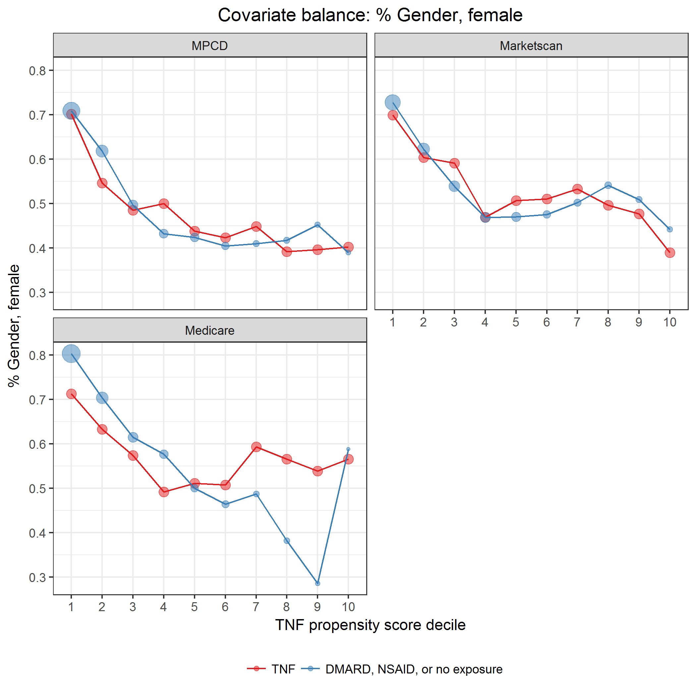
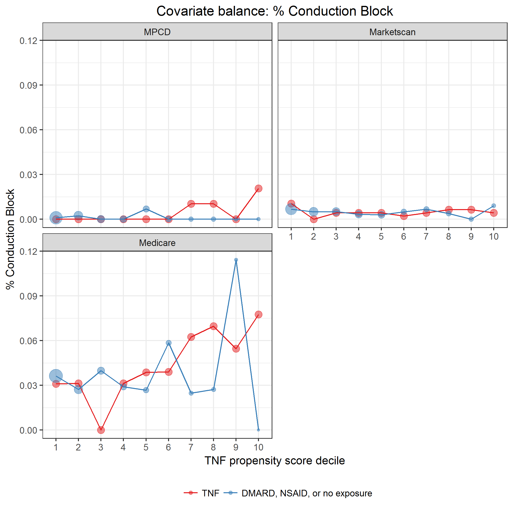

# Propensity score

Read deidentified propensity score data.
Data was created by [`modelPropensityScore.sas`](../scripts/modelPropensityScore.sas).

* Image files saved as [PNG](../figures/densityPS.png), [SVG](../figures/densityPS.svg)


```{r}
D0 <- 
  read.csv("../data/processed/psDeidentified.csv") %>% 
  filter(model == "3-level exposure") %>% 
  mutate(indCommonSupport = as.logical(indCommonSupport)) %>% 
  mutate(exposure = droplevels(exposure),
         X_LEVEL_ = droplevels(X_LEVEL_)) %>% 
  mutate(exposure = factor(exposure,
                           levels = c("TNF", "DMARD", "NSAID or no exposure")),
         X_LEVEL_ = factor(X_LEVEL_,
                           levels = c("TNF", "DMARD", "NSAID or no exposure")))
```

\newline

```{r}
D0 %>%
  group_by(indCommonSupport, model, exposure) %>% 
  summarize(n = length(ps),
            minPS = min(ps, na.rm = TRUE),
            maxPS = max(ps, na.rm = TRUE),
            minIPTW = min(iptw, na.rm = TRUE),
            maxIPTW = max(iptw, na.rm = TRUE)) %>% 
  kable(digits = 3)
```

\newline

```{r}
D1 <- 
  read.csv("../data/processed/commonSupportRegion.csv") %>% 
  filter(model == "3-level exposure")
D1 %>% kable()
```

```{r, fig.show = "hide", warning = FALSE, message = FALSE}
f <- "densityPS"
G <- 
  D0 %>% 
  ggplot +
    ggtitle("Propensity score\nCommon support") +
    aes(x = ps, color = exposure, fill = exposure) +
    annotate("rect", xmin = 0, xmax = D1$commonSupportLowerBound, ymin = -Inf, ymax = Inf, alpha = 1/4) +
    annotate("rect", xmin = D1$commonSupportUpperBound, xmax = 1, ymin = -Inf, ymax = Inf, alpha = 1/4) +
    geom_density(alpha = 1/3) +
    facet_wrap(~ X_LEVEL_, scales = "free_y", ncol = 1) + 
    scale_y_continuous("Density") +
    scale_x_continuous("Propensity score",
                       trans = "identity",
                       breaks = c(D1$commonSupportLowerBound,
                                  c(seq(0.1, 0.8, 0.1), 0.95),
                                  D1$commonSupportUpperBound,
                                  0, 1),
                       limits = c(0, 1),
                       labels = c(sprintf("%.02f", D1$commonSupportLowerBound),
                                  sprintf("%.01f", seq(0.1, 0.8, 0.1)),
                                  sprintf("%.02f", c(0.95)),
                                  sprintf("%.02f", D1$commonSupportUpperBound),
                                  0, 1)) +
    scale_color_brewer("", palette = "Set1") +
    scale_fill_brewer("", palette = "Set1") +
    theme(axis.text.y = element_blank(),
          axis.ticks.y = element_blank(),
          legend.position = "bottom",
          panel.grid = element_blank(),
          plot.title = element_text(hjust = 0.5))
ggsave(paste0("../figures/", f, ".png"), dpi = 300)
ggsave(paste0("../figures/", f, ".svg"), dpi = 300)
```


## Covariate balance

Include only episodes with propensity scores in the common support region.

```{r}
df <- 
  D0 %>% 
  filter(indCommonSupport == TRUE)
```

**Propensity of NSAID or no exposure.**
Create propensity score deciles.

```{r}
df <-
  df %>% 
  filter(X_LEVEL_ == "NSAID or no exposure") %>% 
  group_by(model) %>% 
  mutate(psDecile = cut(ps,
                        breaks = quantile(ps, probs = seq(0, 1, 0.1)),
                        include.lowest = TRUE,
                        label = FALSE)) %>% 
  mutate(psDecileLabel = sprintf("%d: %s",
                                 psDecile,
                                 gsub(",",
                                      ", ",
                                      cut(ps,
                                          breaks = quantile(ps, probs = seq(0, 1, 0.1)),
                                          include.lowest = TRUE,
                                          dig.lab = 2))))
df %>% 
  group_by(model, exposure, psDecile) %>% 
  summarize(n = length(ps), min = min(ps), max = max(ps)) %>% 
  kable(digits = 2)
```

\newline



```{r, fig.show = "hide", warning = FALSE, message = FALSE}
f <- "covarBalGender"
df <- df %>% mutate(genderFemale = SEX == "F")
L <- covariateBalance("dichotomous", "genderFemale", "% Gender, female")
ggsave(paste0("../figures/", f, ".png"), dpi = 300)
ggsave(paste0("../figures/", f, ".svg"), dpi = 300)
```


```{r, fig.show = "hide", warning = FALSE, message = FALSE}
f <- "covarBalAge"
L <- covariateBalance("continuous", "age", "Age, mean")
ggsave(paste0("../figures/", f, ".png"), dpi = 300)
ggsave(paste0("../figures/", f, ".svg"), dpi = 300)
```


```{r, fig.show = "hide", warning = FALSE, message = FALSE}
f <- "covarBalDiabetes"
L <- covariateBalance("dichotomous", "indDiabetes", "% Diabetes")
ggsave(paste0("../figures/", f, ".png"), dpi = 300)
ggsave(paste0("../figures/", f, ".svg"), dpi = 300)
```


```{r, fig.show = "hide", warning = FALSE, message = FALSE}
f <- "covarBalHT"
L <- covariateBalance("dichotomous", "indHT", "% Hypertension")
ggsave(paste0("../figures/", f, ".png"), dpi = 300)
ggsave(paste0("../figures/", f, ".svg"), dpi = 300)
```


```{r, fig.show = "hide", warning = FALSE, message = FALSE}
f <- "covarBalMetabSyn"
L <- covariateBalance("dichotomous", "indMetabSyn", "% Metabolic syndrome")
ggsave(paste0("../figures/", f, ".png"), dpi = 300)
ggsave(paste0("../figures/", f, ".svg"), dpi = 300)
```


```{r, fig.show = "hide", warning = FALSE, message = FALSE}
f <- "covarBalNAFattyLiverDis"
L <- covariateBalance("dichotomous", "indNAFattyLiverDis", "% Non-alcoholic fatty liver disease")
ggsave(paste0("../figures/", f, ".png"), dpi = 300)
ggsave(paste0("../figures/", f, ".svg"), dpi = 300)
```


```{r, fig.show = "hide", warning = FALSE, message = FALSE}
f <- "covarBalHematCa"
L <- covariateBalance("dichotomous", "indHematCa", "% Hematologic Cancer")
ggsave(paste0("../figures/", f, ".png"), dpi = 300)
ggsave(paste0("../figures/", f, ".svg"), dpi = 300)
```


```{r, fig.show = "hide", warning = FALSE, message = FALSE}
f <- "covarBalNMSC"
L <- covariateBalance("dichotomous", "indNMSC", "% Non Melanoma Skin Cancer")
ggsave(paste0("../figures/", f, ".png"), dpi = 300)
ggsave(paste0("../figures/", f, ".svg"), dpi = 300)
```


```{r, fig.show = "hide", warning = FALSE, message = FALSE}
f <- "covarBalSolidCa"
L <- covariateBalance("dichotomous", "indSolidCa", "% Solid Cancer")
ggsave(paste0("../figures/", f, ".png"), dpi = 300)
ggsave(paste0("../figures/", f, ".svg"), dpi = 300)
```


```{r, fig.show = "hide", warning = FALSE, message = FALSE}
f <- "covarBalAortInsuffRegurg"
L <- covariateBalance("dichotomous", "indAortInsuffRegurg", "% Aortic Insufficiency/Aortic Regurgitation")
ggsave(paste0("../figures/", f, ".png"), dpi = 300)
ggsave(paste0("../figures/", f, ".svg"), dpi = 300)
```



```{r, fig.show = "hide", warning = FALSE, message = FALSE}
f <- "covarBalConductBlock"
L <- covariateBalance("dichotomous", "indConductBlock", "% Conduction Block")
ggsave(paste0("../figures/", f, ".png"), dpi = 300)
ggsave(paste0("../figures/", f, ".svg"), dpi = 300)
```


```{r, fig.show = "hide", warning = FALSE, message = FALSE}
f <- "covarBalMI"
L <- covariateBalance("dichotomous", "indMI", "% Myocardial infarction")
ggsave(paste0("../figures/", f, ".png"), dpi = 300)
ggsave(paste0("../figures/", f, ".svg"), dpi = 300)
```


```{r, fig.show = "hide", warning = FALSE, message = FALSE}
f <- "covarBalHospInf"
L <- covariateBalance("dichotomous", "indHospInf", "% Hospitalized infection")
ggsave(paste0("../figures/", f, ".png"), dpi = 300)
ggsave(paste0("../figures/", f, ".svg"), dpi = 300)
```


```{r, fig.show = "hide", warning = FALSE, message = FALSE}
f <- "covarBalOppInf"
L <- covariateBalance("dichotomous", "indOppInf", "% Opportunistic infection")
ggsave(paste0("../figures/", f, ".png"), dpi = 300)
ggsave(paste0("../figures/", f, ".svg"), dpi = 300)
```


```{r, fig.show = "hide", warning = FALSE, message = FALSE}
f <- "covarBalCrohnsDis"
L <- covariateBalance("dichotomous", "indCrohnsDis", "% Crohn's Disease")
ggsave(paste0("../figures/", f, ".png"), dpi = 300)
ggsave(paste0("../figures/", f, ".svg"), dpi = 300)
```


```{r, fig.show = "hide", warning = FALSE, message = FALSE}
f <- "covarBalUlcerColitis"
L <- covariateBalance("dichotomous", "indUlcerColitis", "% Ulcerative Colitis")
ggsave(paste0("../figures/", f, ".png"), dpi = 300)
ggsave(paste0("../figures/", f, ".svg"), dpi = 300)
```


```{r, fig.show = "hide", warning = FALSE, message = FALSE}
f <- "covarBalAmyloidosis"
L <- covariateBalance("dichotomous", "indAmyloidosis", "% Amyloidosis")
ggsave(paste0("../figures/", f, ".png"), dpi = 300)
ggsave(paste0("../figures/", f, ".svg"), dpi = 300)
```


```{r, fig.show = "hide", warning = FALSE, message = FALSE}
f <- "covarBalIgANeph"
L <- covariateBalance("dichotomous", "indIgANeph", "% IgA nephropathy")
ggsave(paste0("../figures/", f, ".png"), dpi = 300)
ggsave(paste0("../figures/", f, ".svg"), dpi = 300)
```


```{r, fig.show = "hide", warning = FALSE, message = FALSE}
f <- "covarBalNephSyn"
L <- covariateBalance("dichotomous", "indNephSyn", "% Nephrotic syndrome")
ggsave(paste0("../figures/", f, ".png"), dpi = 300)
ggsave(paste0("../figures/", f, ".svg"), dpi = 300)
```


```{r, fig.show = "hide", warning = FALSE, message = FALSE}
f <- "covarBalApicalPulmFib"
L <- covariateBalance("dichotomous", "indApicalPulmFib", "% Apical Pulmonary fibrosis")
ggsave(paste0("../figures/", f, ".png"), dpi = 300)
ggsave(paste0("../figures/", f, ".svg"), dpi = 300)
```


```{r, fig.show = "hide", warning = FALSE, message = FALSE}
f <- "covarBalInterstLungDis"
L <- covariateBalance("dichotomous", "indInterstLungDis", "% Interstitial lung disease")
ggsave(paste0("../figures/", f, ".png"), dpi = 300)
ggsave(paste0("../figures/", f, ".svg"), dpi = 300)
```


```{r, fig.show = "hide", warning = FALSE, message = FALSE}
f <- "covarBalRestrictLungDis"
L <- covariateBalance("dichotomous", "indRestrictLungDis", "% Restrictive lung disease")
ggsave(paste0("../figures/", f, ".png"), dpi = 300)
ggsave(paste0("../figures/", f, ".svg"), dpi = 300)
```


```{r, fig.show = "hide", warning = FALSE, message = FALSE}
f <- "covarBalCaudaEquina"
L <- covariateBalance("dichotomous", "indCaudaEquina", "% Cauda Equina syndrome")
ggsave(paste0("../figures/", f, ".png"), dpi = 300)
ggsave(paste0("../figures/", f, ".svg"), dpi = 300)
```


```{r, fig.show = "hide", warning = FALSE, message = FALSE}
f <- "covarBalSpinalCordComp"
L <- covariateBalance("dichotomous", "indSpinalCordComp", "% Spinal Cord compression")
ggsave(paste0("../figures/", f, ".png"), dpi = 300)
ggsave(paste0("../figures/", f, ".svg"), dpi = 300)
```


```{r, fig.show = "hide", warning = FALSE, message = FALSE}
f <- "covarBalVertFrac"
L <- covariateBalance("dichotomous", "indVertFrac", "% Clinical vertebral fracture")
ggsave(paste0("../figures/", f, ".png"), dpi = 300)
ggsave(paste0("../figures/", f, ".svg"), dpi = 300)
```


```{r, fig.show = "hide", warning = FALSE, message = FALSE}
f <- "covarBalNonVertOsFrac"
L <- covariateBalance("dichotomous", "indNonVertOsFrac", "% Non-vertebral osteoporotic fracture")
ggsave(paste0("../figures/", f, ".png"), dpi = 300)
ggsave(paste0("../figures/", f, ".svg"), dpi = 300)
```


```{r, fig.show = "hide", warning = FALSE, message = FALSE}
f <- "covarBalPsoriasis"
L <- covariateBalance("dichotomous", "indPsoriasis", "% Psoriasis")
ggsave(paste0("../figures/", f, ".png"), dpi = 300)
ggsave(paste0("../figures/", f, ".svg"), dpi = 300)
```


```{r, fig.show = "hide", warning = FALSE, message = FALSE}
f <- "covarBalPSA"
L <- covariateBalance("dichotomous", "indPSA", "% Psoriatic arthritis")
ggsave(paste0("../figures/", f, ".png"), dpi = 300)
ggsave(paste0("../figures/", f, ".svg"), dpi = 300)
```


```{r, fig.show = "hide", warning = FALSE, message = FALSE}
f <- "covarBalUveitis"
L <- covariateBalance("dichotomous", "indUveitis", "% Uveitis")
ggsave(paste0("../figures/", f, ".png"), dpi = 300)
ggsave(paste0("../figures/", f, ".svg"), dpi = 300)
```
